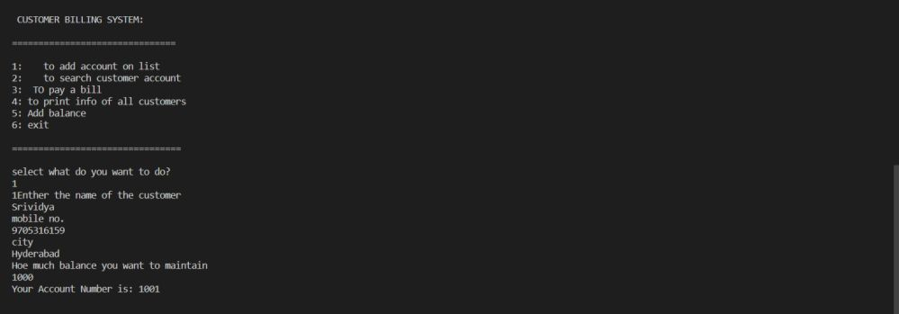
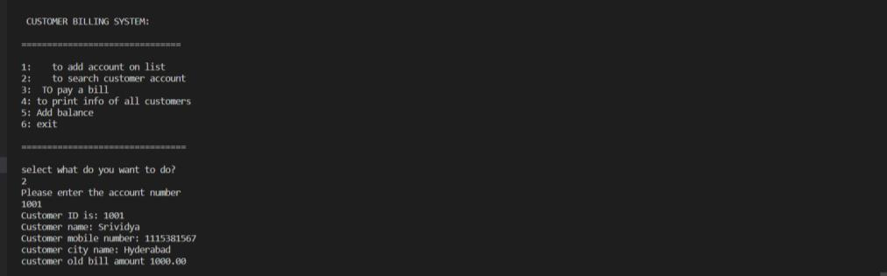
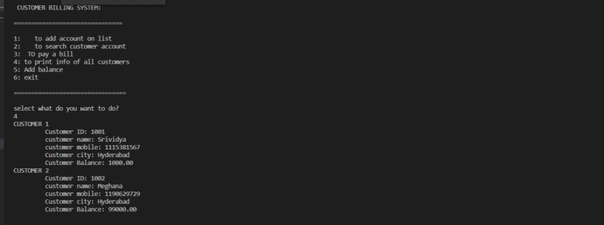

# Creating account for a customer

# Printing the information of a particular customer

# Paying the bill

# Printing the information of all customers

# Adding balance to the customer's E-Wallet
